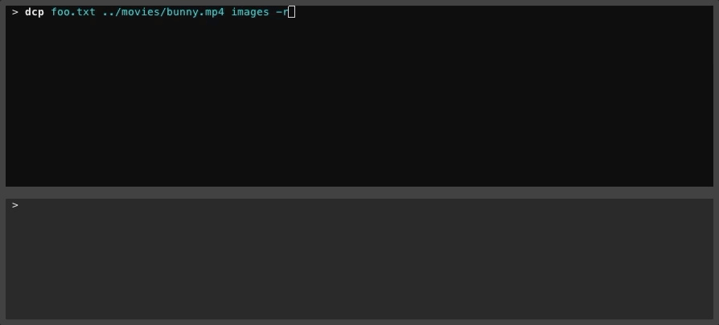

`dcp` - Dat Copy
========

> Remote file copy, powered by the Dat protocol.

[](https://circleci.com/gh/tom-james-watson/workflows/dat-cp/tree/master)
[](https://www.npmjs.com/package/dat-cp)
[](https://www.npmjs.com/package/dat-cp)
[](https://www.npmjs.com/package/dat-cp)

`dcp` copies files between hosts on a network using the peer-to-peer [Dat network](https://datproject.org/). `dcp` can be seen as an alternative to tools like `scp`, removing the need to configure SSH access between hosts. This lets you transfer files between two remote hosts, without you needing to worry about the specifics of how said hosts reach each other and regardless of whether hosts are behind NATs. 

`dcp` requires zero configuration and is secure, fast, and peer-to-peer.

**WARNING - this is not production-ready software. Use at your own risk**

### Use cases

* Sync files between two physical computers on your local network, without needing to set up SSH access.
* Send files to multiple colleagues - just send the generated public key via chat and they can receive the files on their machine.
* Copy files to a remote server.

### Example



### How `dcp` works

`dcp` will create a dat archive for a specified set of files or directories and, using the generated public key, lets you download said archive from a second host. Any data shared over the network is encrypted using the public key of the archive, meaning data access is limited to those who have access to said key. For more information on how Dat works, you can browse [the docs](https://docs.datproject.org/) or [read their whitepaper](https://github.com/datproject/docs/blob/master/papers/dat-paper.pdf).

### Advantages over plain [dat](https://github.com/datproject/dat)

`dcp` is designed to have an API that is more reminiscent of `scp` and `rsync`. The standard cli `dat` program requires the additional mental overhead of understanding how the underlying Dat protocol works. `dat` forces you to share a single whole folder, whilst with `dcp` you can copy an arbitrary set of paths. `dat` also pollutes the filesystem with metadata files, whereas with `dcp` these are kept in-memory instead.

## Installation

```
npm i -g dat-cp
```

## Usage

```
Usage: dcp [options] {source ... | key}

Dat Copy - remote file copy, powered by the dat protocol.

Options:
  -V, --version    output the version number
  -r, --recursive  recursively copy directories
  -n, --dry-run    show what files would have been copied
  -v, --verbose    verbose mode - prints extra debugging messages
  -h, --help       output usage information
```

### Sending files

Pass an arbitrary set of files or directories to `dcp` to be copied. Copy the generated public key and use it to receive the files on a different host.

```bash
> dcp [-r] [-n] [-v] files ...
```

* Use `-n`/`--dry-run` to see what files will be sent.
* Use `-r`/`--recursive` to recursively copy files within directories.
* Use `-v`/`--verbose` to print extra debugging information

### Receiving files

Invoke `dcp` with the generated public key to receive the copied files.

```bash
> dcp <generated public key>
```

* Use `-n`/`--dry-run` to see what files will be received.
* Use `-v`/`--verbose` to print extra debugging information

## Development

Install dependencies:

```
npm i
```

Run the tests:

```
npm t
```

Test the CLI executable

```
npm run cli -- foo.txt -v
```

*Note the `--` preceding the arguments.*
